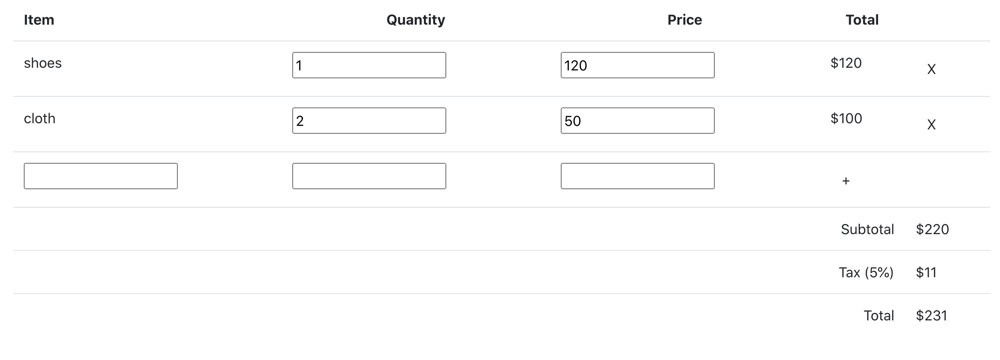

# Invoice Editor

A simple invoice editor application

## Usage

In CLI:

```sh
npm install && npm start
```

It should start up development server and open up a web browser

To run Redux reducer test:

```sh
npm test
```

Then, press `a` to run test.

## Features

- Add, edit, or remove line items
- Pricing will be updated on-the-fly as items are added or edited

## Dependencies

- Create-React-App
- Redux
- Webpack
- Jest
- Bootstrap

## Notes

- This application is built with Create-React-App, which means it uses `Jest` for testing, `Webpack` and `Babel` for compiling and building application.
